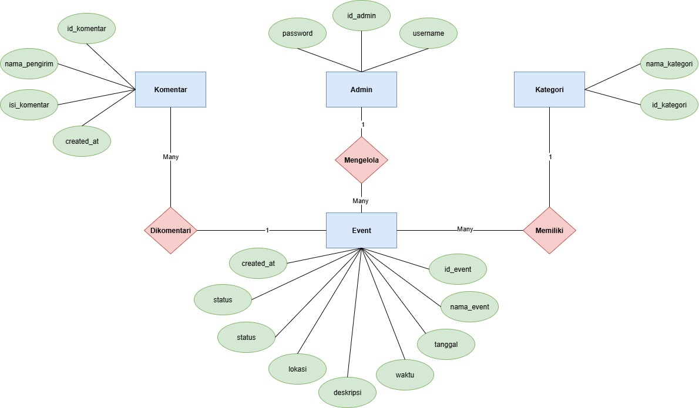

# EVENTA # Info Event Palu

Dokumentasi awal proyek.

# Sistem Informasi "Info Event Palu"
**Versi:** 2.0  
**Tanggal Dokumen:** 21 Oktober 2025  
**Jenis Sistem:** Portal Informasi Event Berbasis Web  
**Teknologi:** Laravel 11 + MySQL

---

## 1. Deskripsi Umum Sistem

Sistem **Info Event Palu** adalah sebuah portal informasi yang berfungsi sebagai direktori terpusat untuk berbagai acara yang berlangsung di Kota Palu. Sistem ini dirancang untuk memudahkan masyarakat dalam menemukan informasi event secara akurat dan terverifikasi, sekaligus menyediakan mekanisme kontribusi event dari publik dengan proses moderasi oleh Admin.

Sistem berjalan sebagai aplikasi web dan dapat diakses melalui perangkat desktop maupun mobile.

---

## 2. Tujuan Pengembangan

1. Menyediakan platform tunggal yang menampilkan daftar event di Kota Palu.
2. Mempermudah masyarakat dalam mencari, memfilter, dan melihat detail event.
3. Mengakomodasi pengajuan event baru oleh masyarakat secara terbuka.
4. Memastikan validitas informasi melalui proses moderasi oleh Admin.
5. Menyediakan halaman dasbor khusus bagi Admin untuk mengelola data sistem.

---

## 3. Peran dan Hak Akses Pengguna

| Peran | Hak Akses Utama |
|------|----------------|
| **Pengunjung** | Melihat event, mencari, memfilter, memberi komentar |
| **Kontributor (Publik)** | Mengajukan event baru melalui formulir tanpa login |
| **Admin** | Login, CRUD event & kategori, moderasi komentar & event |

---

## 4. Fitur Utama Sistem

### 4.1 Fitur Publik
- Melihat daftar event yang diurutkan berdasarkan tanggal terdekat.
- Pencarian event berdasarkan kata kunci.
- Filter event berdasarkan kategori.
- Pengurutan event (misal: terbaru → terlama).
- Halaman Detail Event + komentar/ulasan.
- Pengajuan event melalui form publik.

### 4.2 Fitur Admin
- Login Admin (autentikasi aman + hashing password).
- Manajemen Event (CRUD).
- Manajemen Kategori (CRUD).
- Moderasi event yang diajukan publik (Setujui / Tolak).
- Moderasi komentar publik.

### 4.3 Fitur Otomatis
- Sistem otomatis mengubah status event menjadi **"Telah Selesai"** setelah tanggal penyelenggaraan terlewati.

---

## 5. Kriteria Penerimaan (Acceptance Criteria)

| Kode | Fitur | Kriteria Berhasil |
|-----|-------|------------------|
| KP-01 | CRUD Event | Admin dapat menambah, mengedit, menghapus event |
| KP-02 | Pengajuan Event | Event baru tersimpan dengan status “Menunggu Persetujuan” |
| KP-03 | Moderasi Event | Event disetujui → tampil publik, ditolak → terhapus |
| KP-04 | CRUD Kategori | Admin dapat kelola data kategori |
| KP-05 | Pencarian & Filter | Hasil yang ditampilkan relevan dan akurat |
| KP-06 | Status Event Otomatis | Status berubah otomatis menjadi “Telah Selesai” setelah tanggal terlewati |
| KP-07 | Komentar | Pengunjung mampu memberi komentar, Admin mampu moderasi |

---

## 📌 ERD Sistem Info Event Palu

## 📌 USE CASE

